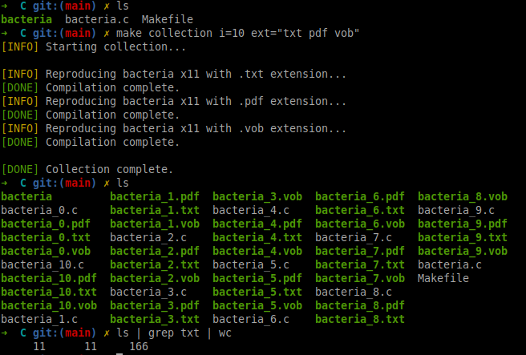
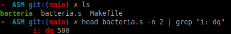
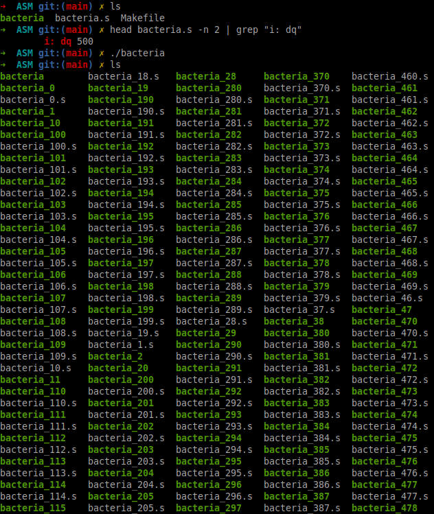

# bacteria

## Description

This C/ASM project explores the principle of self-reproduction through the implementation of a quine, a program that produces a copy of its own source code as output.<br />
It delves into the challenges associated with self-replicating code and serves as an excellent introduction to more complex topics, including malware development, providing insights into the mechanisms and implications of self-replicating programs.

## Features

The project includes both C and ASM versions of the self-replicating program, named **bacteria**.

### Functionality

When executed, the program performs the following actions:

- It creates a file named `bacteria_X.c` or `bacteria_X.s`, where `X` is an integer defined in the source code.
- After creating the file, it compiles and runs the newly created program.

### Execution Rules

1. The program stops based on the file name: it executes only if the integer `X` is greater than or equal to 0.
2. The integer, initially set to 50, is decremented with each execution, controlling how many iterations the program performs.

## Settings (C Code)
You can set your own values for the following variables by changing the assigned values directly on the source file:
### File name
```c
#define FNAME "bacteria"
```

### Extension name
```c
#define EXT ".ext"
```

### Reproduction quantity
```c
int i = 50;
```

## Usage
### Build and run

#### ASM
```bash
cd ASM/
make
./bacteria
```

#### C
```bash
cd C/
make
./bacteria

# Produce a given quantity of quines of different file extensions 
cd C/
make collection i=<QUANTITY> ext=<EXTENSION,...>

Example:
make collection i=10 ext="txt pdf vob"
```


### Testing

#### Quine verification
To test if all generated files are quines (i.e., they produce the same code with only the variable value differing), run:
```bash
make test
```
in the ASM/C directory.<br /><br />

This command will execute the test suite to verify that each generated program correctly replicates its source code, differing only in the index variable.

#### Collection
To generate a collection of quines that have different extensions:
```bash
./test.sh
```

## Screenshots

1. **Before Execution**:

No replication has occurred yet. Index is at 50.
<br />
2. **After Execution**:

This shows the replicated files created by the program.
